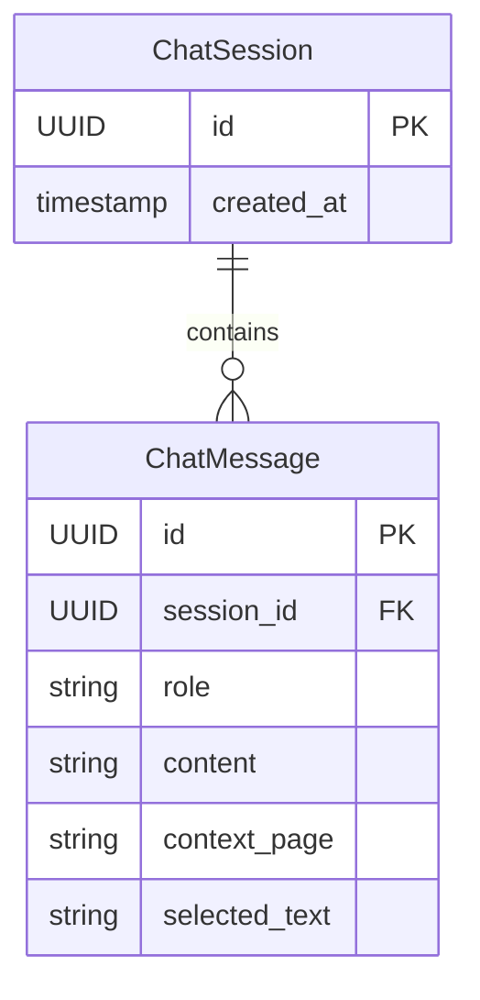

# Data Model: Context-Aware RAG Chatbot

## Entities

### 1. TextbookChunk (Vector Store - Qdrant)
Represents a segment of the textbook used for retrieval.

| Field | Type | Description |
|-------|------|-------------|
| `id` | UUID/String | Unique identifier (hash of content + path). |
| `content` | Text | The actual text content. |
| `embedding` | Vector[1536] | OpenAI `text-embedding-3-small` vector. |
| `metadata.source_page` | String | URL slug of the page (e.g., `/docs/intro`). |
| `metadata.header_path` | String | Hierarchy of headers (e.g., "ROS2 Fundamentals > Nodes"). |
| `metadata.chapter` | String | Top-level module (e.g., "ROS 2"). |

### 2. ChatSession (Relational - Neon Postgres)
Represents a conversation thread.

| Field | Type | Constraints | Description |
|-------|------|-------------|-------------|
| `id` | UUID | PK | Unique session ID (stored in browser local storage). |
| `created_at` | Timestamp | Default: Now | When the session started. |
| `user_id` | String | Nullable | Optional user ID if auth is added later. |

### 3. ChatMessage (Relational - Neon Postgres)
Represents a single turn in the conversation.

| Field | Type | Constraints | Description |
|-------|------|-------------|-------------|
| `id` | UUID | PK | Unique message ID. |
| `session_id` | UUID | FK -> ChatSession.id | The session this message belongs to. |
| `role` | Enum | 'user' \| 'assistant' | Who sent the message. |
| `content` | Text | | The text of the message. |
| `context_page` | String | Nullable | (User msgs only) Page user was on. |
| `selected_text` | Text | Nullable | (User msgs only) Text selected by user. |
| `created_at` | Timestamp | Default: Now | Timestamp. |

## ER Diagram (Conceptual)

